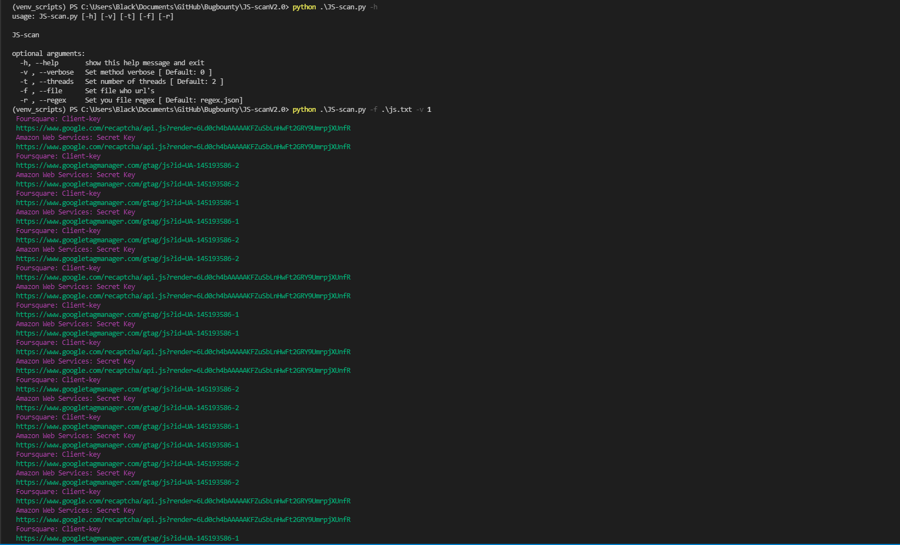

# JS-scan V2.0 ¯(ツ)/¯

look, I know what you're thinking but I can say that's not what you're thinking. 
Ever seen something with this name? 
Must be a mistake, don't tell my secret and I won't tell yours :)

[regex.json](https://github.com/odomojuli/RegExAPI)

**Default** 
`python JS-scan.py -f js-file.txt -v 1`

>remember, I put the option to define an external regex.
So the better your regex, the better the results,
the script comes with a ready-to-use regex, but don't rely on it too much

**Threads** 
`python -f js-file.txt -t 100 -v 1`

##### Hey you, yes yourself, I know you have a really crazy regex, send it to me with a POC that I will add to the script

# Known bugs

*[ -v 2 ] can bring a trash or broken strings, this is because of the regex that is provided to the script.*