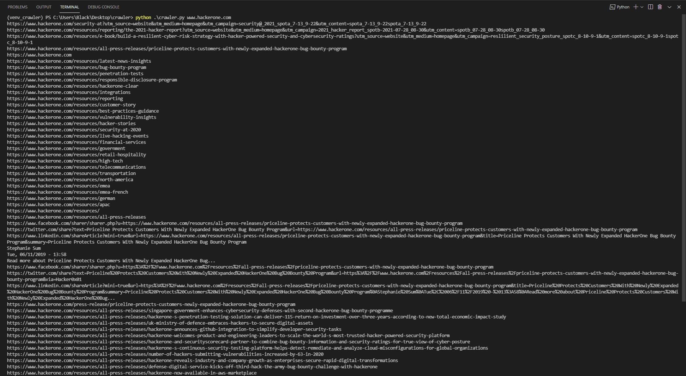

# Simple crawler

>python 3.6 >= 

`python crawler.py < domain >`

*at the end of the crawl the script saves everything it finds in a file with the same domain name*

>you might be thinking, ok, but how would I do with multiple domains, hahah my friend, here's a little gift for you :)

`rush -i domains.txt 'python crawler.py {}'`