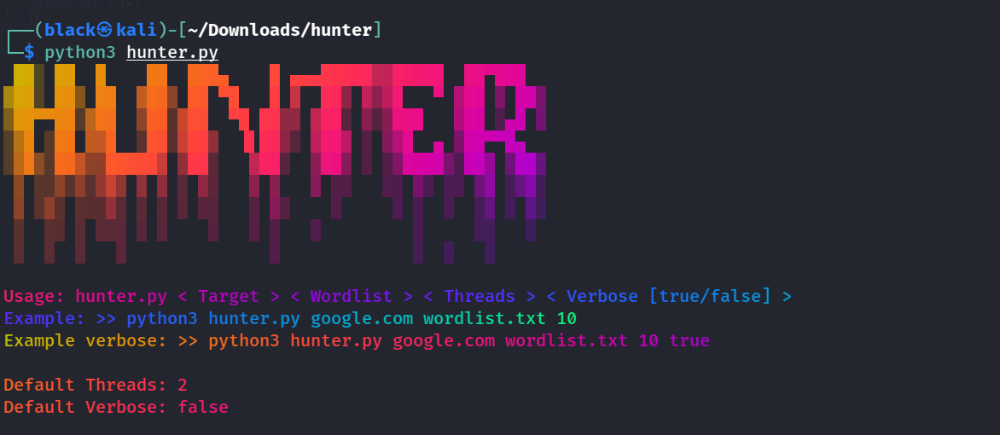
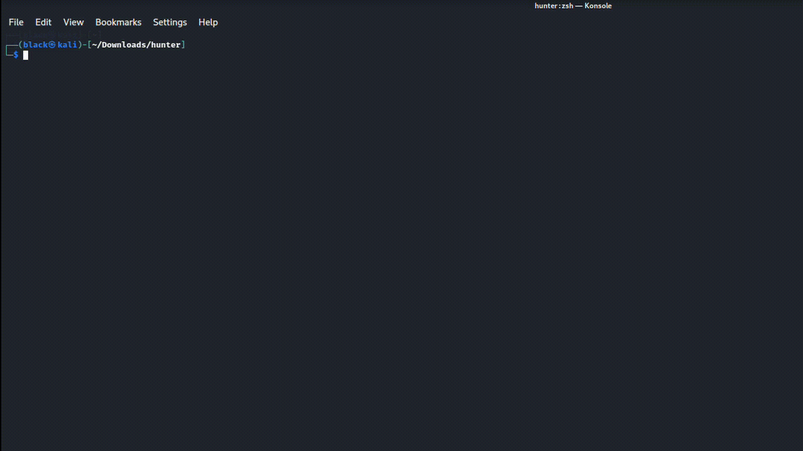
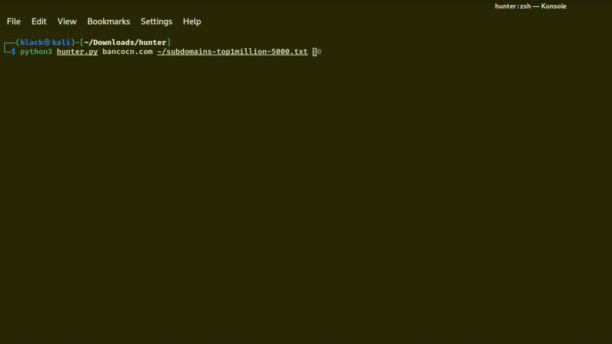

<p align="center">
  
</p>

#### Developed to hunt subdomain, the tool is in an Alpha version.

<p align="center">
  
</p>


### Example with ten threads:
<p align="center">
  
</p>

### Example with Verbose TRUE:
<p align="center">
  
</p>


# Dependency

* figlet
* lolcat
* dnspython
* banner "Bloody.flf"

### The installation can be done manually, but I already let the ```install.sh``` ready to help

**Instalation:** <br><br>
```chmod +x install.sh``` <br>
```sudo ./install.sh``` <br>
```Done :)```

# NOTE

For the tool to function rightly configure your ```/etc/resolv.conf```

```
nameserver 8.8.8.8
nameserver 8.8.4.4
nameserver <you Gateway>
```